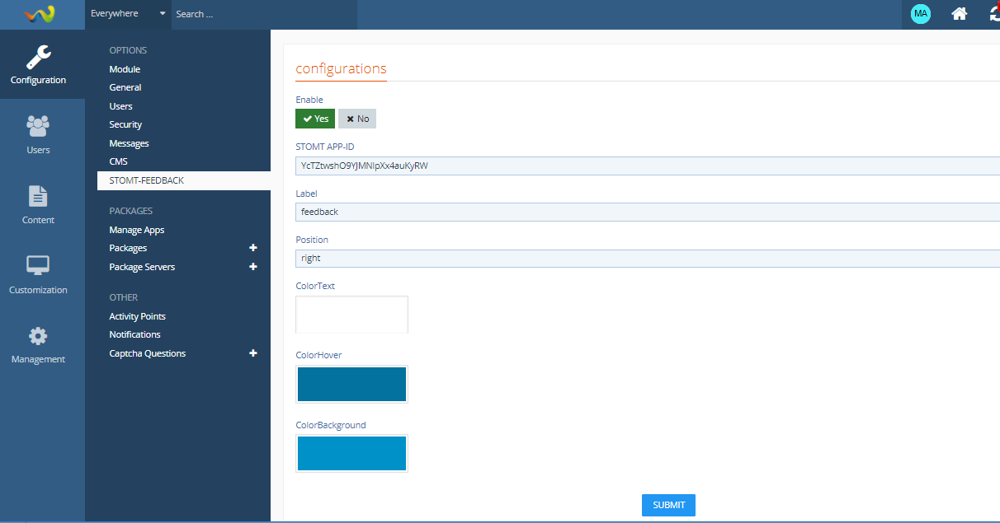
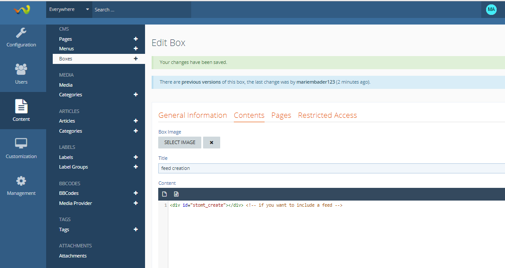
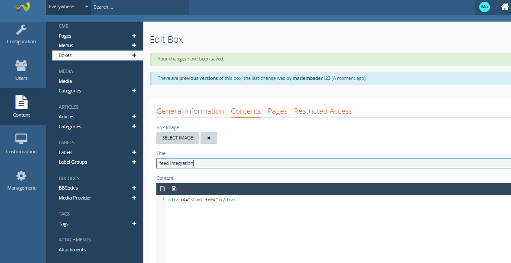

# stomt-Woltlab-extension
STOMT Woltlab Integration https://www.stomt.com

How to integrate STOMT on your Woltlab website?

## Installation

You can easily search and install the STOMT WoltLab plugin via the [WoltLab Package Manager](https://pluginstore.woltlab.com/file/2810-stomt-feedback/).

1. Open the Woltlab administrator page, choose "Packages" and then "Install Package".

2. Search for "STOMT Feedback" and install the plugin.

3. A new item will appear in the left navigation bar "STOMT-FEEDBACK". Select it, add your [APP-ID](https://www.stomt.com/go/apps) on the configuration page. Make sure you save your changes.


## Manuell Installation

Alternativly you can install the package directly from its source.

1. Download [de.stomt.feedback.tar.gz](https://github.com/stomt/stomt-woltlab-extension/raw/master/de.stomt.feedback.tar.gz).

2. Open the Woltlab administrator page, choose "Packages" and then "Install Package".

3. Upload `de.stomt.feedback.tar.gz` in the "Upload Package" tab.

4. A new item will appear in the left navigation bar "STOMT-FEEDBACK". Select it, add your [APP-ID](https://www.stomt.com/go/apps) on the configuration page. Make sure you save your changes.


### Configuration

The parameters can be configured in the admin-panel to initialize the widget.

| Property | Type | Description |
| :--- | :--- | :--- |
| `STOMT APP-ID` _(required)_ | String | The `appId` is your pages application id. You can find it in your application overview in STOMT (https://www.stomt.com/YOUR_PAGE/apps). The target connected to this application id will be used as target. |
| `Button Position` | String | You can set the `Button Position` of the button, the default position is `right`. If required you can align the button to the left side by passing `'left'`. |
| `Button Text` | String | The default label of the button is `Feedback`, you can change that by passing another `label`. |
| `Text Color` | String | To change the colors used for the widget button you have three options to configure. The first one is `Text Color`, it allows you to change the text color (default: `#FFFFFF`). |
| `Background Color` | String | The `Background Color` option allows you to change the background color of the button (default: `#0091C9`). |
| `Background Color (hover)` | String | The `Background Color (hover)` option allows you to change the background color of the button when the user hovers it (default: `#04729E`). |
| `Restrict to specifc languages` | String | Use this option if you want limit the usage of STOMT to specifc language based user groups. Enter a comma separated list of language codes (eg. 'de, en'). |
| `Preload` | Boolean | By setting the property `preload` to `true`, you can tell the Widget to preload the Tab iframe in the background (default: `false`). This reduces the loading delay when showing the Tab for the first time. |


## Example UI

### Admin-panel / User interface:




## Documentation Feed

### Embedded Creation Form



1. Go to Content -> Boxes, click "ADD BOX" and choose "HTML" and click "Next".

2. Add the details of the box (position, visibility, access, ...).

3. Insert the following in the "Contents" tab:

```html
<div id="stomt_create"></div>
```

4. Click "SUBMIT"


### Embedded Feed



1. Go to Content -> Boxes, click "ADD BOX" and choose "HTML" and click "Next".

2. Add the details of the box (position, visibility, access, ...).

3. Insert the following in the "Contents" tab:

```html
<div id="stomt_feed"></div>
```

4. Click "SUBMIT"


## Frequently Asked Questions

### What is STOMT all about?

STOMT lets you instantly give feedback in a predefined format. Head off to https://www.stomt.com to find out more!


## Authors

[Mariem Bader](https://github.com/mariembader123) | [Follow Mariem Bader on STOMT](https://www.stomt.com/mariem-bader)

[Max Klenk](https://github.com/maxklenk) | [Follow Max Klenk on STOMT](https://www.stomt.com/max-klenk)

See also the list of [contributors](https://github.com/stomt/stomt-joomla-extension/contributors) who participated in this project.


## Development

Use [WoltLab Demo](https://www.woltlab.com/demo/) to start a server with the most current version of WoltLab Suite. The `build.sh` script allows you to pack a new version of the package, which can then be uploaded to your WoltLab instance.


## More about STOMT

*Integrate and use STOMT on all your touchpoints.*

* On the web [www.stomt.com](https://www.stomt.com)
* [STOMT for iOS](http://stomt.co/ios)
* [STOMT for Android](http://stomt.co/android)
* [STOMT for Unity](http://stomt.co/unity)
* [STOMT for Unreal](http://stomt.co/unreal)
* [STOMT for Websites](http://stomt.co/web)
* [STOMT for Wordpress](http://stomt.co/wordpress)
* [STOMT for Drupal](http://stomt.co/drupal)
